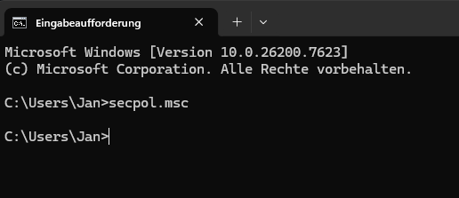
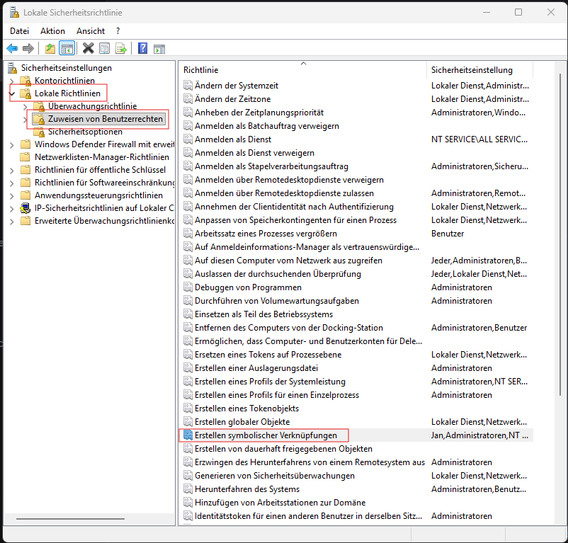
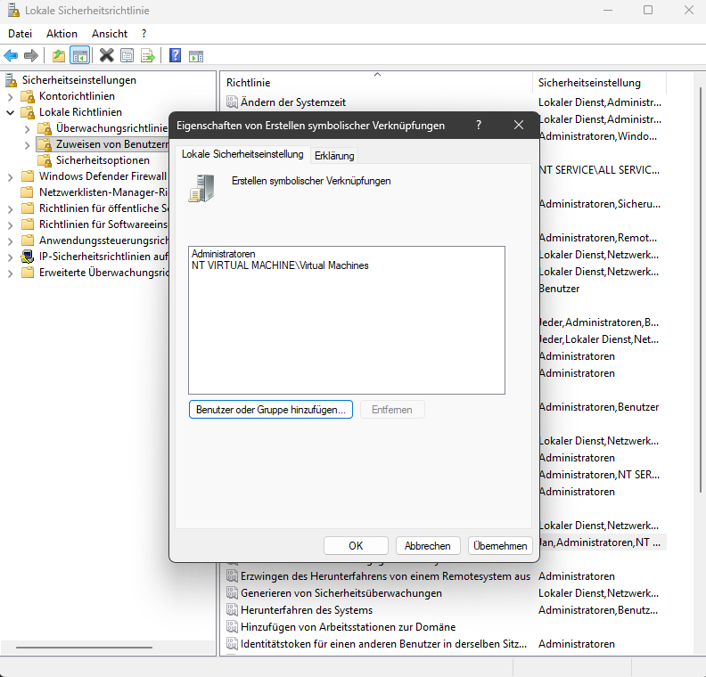
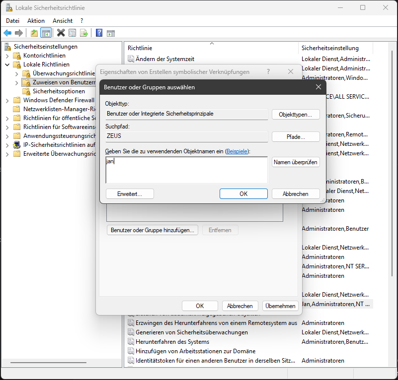

# Slicer-Einstellungen zwischen mehreren Rechnern teilen.

Nutzt man mehrere Rechner um 3D-Dateien für seinen 3D-Drucker zu slicen, so steht man unausweichlich irgendwann vor dem Wunsch seine Slicer-Profile zwischen diesen Rechnern zu synchronisieren.  
Dieses Dokument beschreibt, wie man eine solche "Synchronisierung" mit Hilfe eines NAS/einer Netzwerkfreigabe erreichen kann.  
Strenggenommen ist es keine Synchronisation. Wir richten hier einfach einen gemeinsamen Speicherort für die Slicer-Profile auf der Netzwerkfreigabe ein und "biegen" die Config-Verzeichnisse auf den einzelnen Rechnern dann einfach dorthin um.  

## Hinweis zur zeitgleichen Nutzung des Slicers auf mehreren Rechnern
Eine gleichzeitige Nutzung des Slicers auf mehreren Rechnern ist mit dieser Methode technisch möglich, birgt aber ein Risiko:  
Es ist relativ einfach "Lost Updates" zu produzieren:
1. Der Slicer wird auf Rechner1 geöffnet.
2. Der Slicer wird auf Rechner2 geöffnet.
3. Auf Rechner1 wird EinstellungA in einem Profil geändert und der Slicer danach geschlossen -> Das geänderte Profil wird zentral gespeichert
4. Rechner2 kennt die Änderungen im Profil durch Rechner1 nicht.
5. Auf Rechner2 wird EinstellungB (egal ob im selben Profil oder nicht) geändert und der Slicer danach geschlossen. -> Das geänderte Profil wird zentral gespeichert. Da Rechner2 die Änderungen von Rechner1 unbekannt waren, wurden sie überschrieben.

Daher sollte man entweder Änderungen an Profilen konsequent nur an einem Rechner vornehmen, oder diszipliniert dafür sorgen, dass immer nur 1 Rechner den Slicer zu einem Zeitpunkt nutzt.

# Vorbereitungen

## Rechte vergeben
Um das "Umbiegen" der Config-Verzeichnisse zu ermöglichen muss der Windows-Benutzer zunächst noch entsprechende Rechte bekommen.  
Dazu sind folgende Schritte AUF JEDEM RECHNER, der die Slicer-Config gemeinsam nutzen soll, nötig:
1. Windows Kommandozeile öffnen und das Snap-In "Lokale Sicherheitsrichtlinien" für die Microsoft Management-Konsole öffnen
```
secpol.msc
```


2. In der sich öffnenden Management-Konsole links im Baum "Lokale Richtlinien" und "Zuweisen von Benutzerrechten" auswählen. Im rechten Bereich dann den Eintrag "Erstellen symbolischer Verknüpfungen" suchen.


3. Den Eintrag per Doppelklick öffnen und im sich öffnenden Fenster "Benutzer oder Gruppe hinzufügen" auswählen.


4. Im sich öffnenden Fenster unten im Textbereich den Namen des eigenen Windows-Benutzers eingeben und auf "Namen überprüfen" klicken. Der eingebene Name sollte dann durch "NameDesEigenenRechners\Benutzername" ersetzt werden.


5. Das Fenster "Benutzer oder Gruppe auswählen" mit "OK" schließen
6. Das Fenster "Eigenschaften von Erstellen symbolischer Verknüpfungen" mit "OK" schließen.
7. Die Management-Konsole schließen.
8. Die Kommandozeile schließen.
9. Den Rechner neu starten (dies ist zwingend nötig, damit die neuen Berechtigungen greifen).

## Netzwerkfreigabe erzeugen
Erzeuge auf deinem NAS eine neue Netzwerkfreigabe.  
Im folgenden wird davon ausgegangen, dass dein NAS den Namen `nas` und die Freigabe den Namen `slicerconfig` hat. Dies ist dann im Verlauf dieser Anleitung in den Befehlen zu ersetzen.  
Stelle sicher, dass du im Windows-Explorer den Pfad `\\nas\slicerconfig` aufrufen kannst.

## Backup der Haupt-Slicer-Config und Übertragen der Config auf das NAS
1. Schließe deinen Slicer, sofern er geöffnet ist.
2. Öffne einen Windows-Explorer und gib in die Adresszeile `%appdata%` ein. Der Explorer springt in den Ordner, wo Anwendungen ihre Config-Dateien ablegen.
3. Suche hier nach dem Verzeichnis deines Slicers. Das ist z.B. `PrusaSlicer` oder `OrcaSlicer`. Im folgenden wird in dieser Anleitung von OrcaSlicer ausgegangen und ist dementsprechend bei den Befehlen zu ersetzen.
4. Bennene das Verzeichnis `OrcaSlicer` nach `OrcaSlicer.backup` um. Falls im folgenden etwas schief läuft hast du so eine Sicherung von deinen Profilen.
5. Kopiere den Inhalt (also nicht das Verzeichnis selbst) von `OrcaSlicer.backup` in die Netzwerkfreigabe `\\nas\slicerconfig`
6. Öffne eine Kommandozeile und gebe folgende 2 Befehle ein:
```
cd %appdata%
```
```
mklink /d "%appdata%\OrcaSlicer" "\\nas\slicerconfig"
```
Zu diesem Zeitpunkt solltest du deinen Slicer wieder wie gewohnt auf dem grade umkonfigurierten Rechner nutzen können.

## Konfiguration der weiteren Rechner
Auf jedem weiteren Rechner, der die Config mit nutzen soll, sind folgende Schritte auszuführen:
1. [Rechte vergeben](#rechte-vergeben)
2. Nachdem der Rechner neu gestartet ist stelle sicher, dass der Slicer beendet wurde.
3. Öffne einen Windows-Explorer und gib in der Adresszeile `%appdata%` ein.
4. Suceh den Slicer-Ordner und bennene ihn nach `OrcaSlicer.backup` um.
5. Öffne eine Kommandozeile und gebe folgende 2 Befehle ein:
```
cd %appdata%
```
```
mklink /d "%appdata%\OrcaSlicer" "\\nas\slicerconfig"
```
Nun solltest du auch auf diesem Rechner den Slicer wieder starten können und die Einstellungen/Profile, die vom ersten Rechner kopiert wurden, sehen können.
Wiederhole die Schritte dieses Abschnitt auf jedem Rechner, auf dem du die Slicer-Einstellungen mitbenutzen willst.
